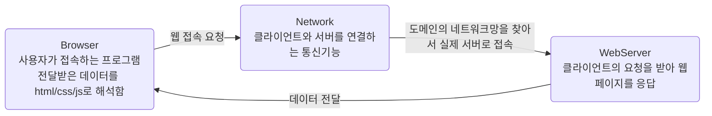

# 웹 페이지가 동작하는 과정 시각화

```mermaid

flowchart LR
    Browser(Browser<br>사용자가 접속하는 프로그램<br>전달받은 데이터를 html/css/js로 해석함)
    WebServer(WebServer<br>클라이언트의 요청을 받아 웹페이지를 응답)
    Network(Network<br>클라이언트와 서버를 연결하는 통신기능 )

    Browser -- 웹 접속 요청 --> Network
    Network -- 도메인의 네트워크망을 찾아서 실제 서버로 접속 --> WebServer
    WebServer -- 데이터 전달  --> Browser
```
